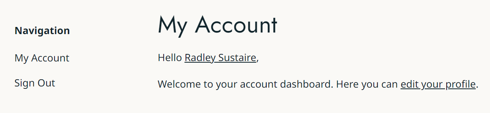

# RS Account Pages (WordPress Plugin)

_Adds an Account Pages post type with custom menus that have conditional logic based on the current user._

```
Contributors: radgh
Requires at least: 6.0
Tested up to: 6.5.2
Requires PHP: 8.0
License: GPLv3
License URI: http://www.gnu.org/licenses/gpl-3.0.txt
```

## Description

This plugin adds the Account Pages post type. You can also create menus in the settings page with conditions based on the user's account. The first menu that meets the conditions is used as the user's account menu.

### Account Page



### Settings Page


### Custom Blocks

- **Account Menu** - Displays a list of account pages based on the menu configured in settings. The first menu matching the conditions will be used for the current user.


## Changelog

### 1.0.6
* Fixed acf fields not being included on settings page

### 1.0.5
* Updated readme with new screenshot of the account page template

### 1.0.4
* Fixed Git Updater by adding the branch name `main` to the plugin header

### 1.0.3
* Added vertical layout to account menu block
* Changed ACF fields to load on acf/init
* Fixed error using as an array on account page archive redirect

### 1.0.2
* Automatically flush rewrite rules after activation

### 1.0.1
* Added Git Updater support

### 1.0.0
* Initial release